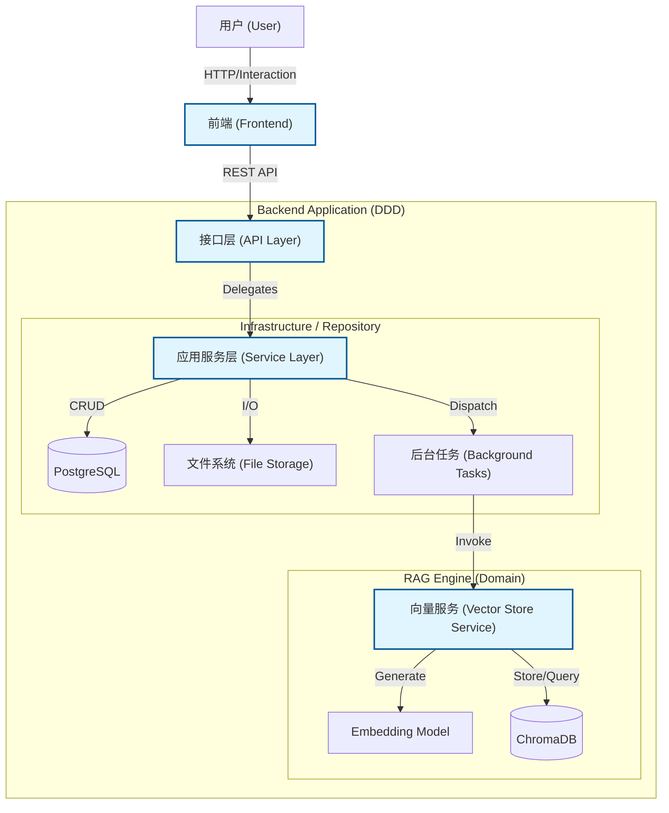
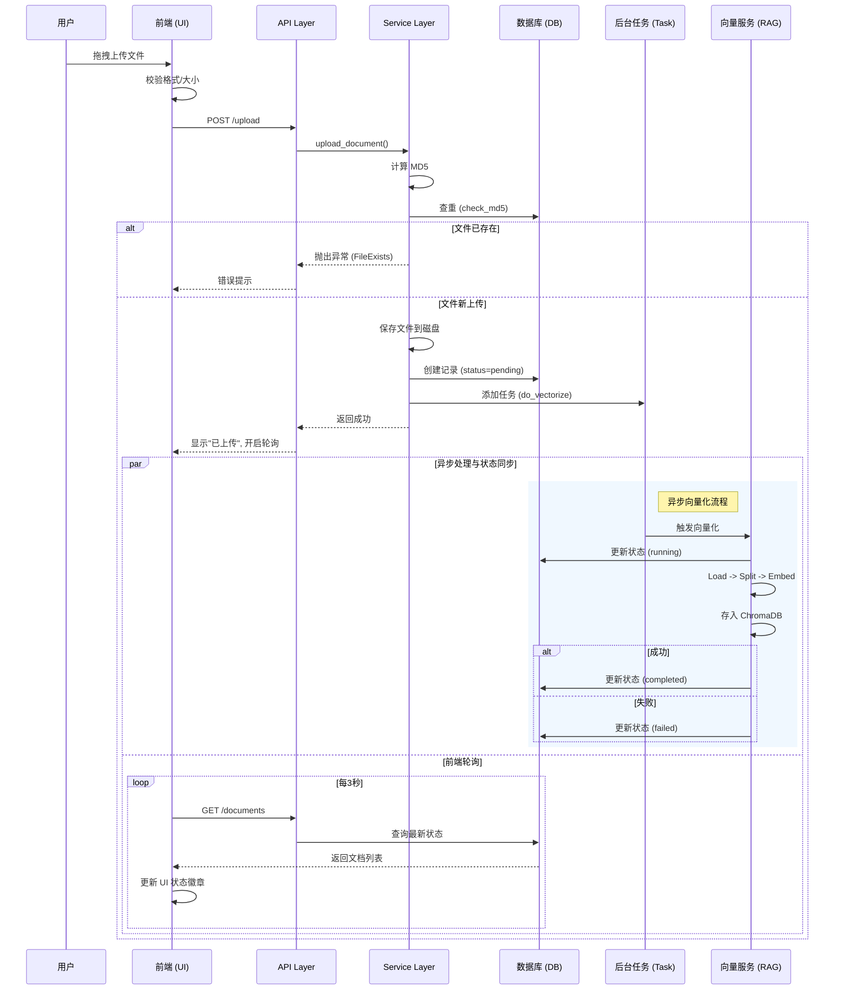

# Vincent Agent 架构文档

本文档提供了 Vincent Agent 项目的架构概览。该系统被设计为一个使用 FastAPI 作为后端，以及原生 HTML/JS/Tailwind CSS 前端的检索增强生成 (RAG) 应用程序。

## 目录结构概览

```
.
├── api/                # API 路由层 (Controller)
│   └── routes/         # 具体路由定义 (knowledge_base.py, index.py)
├── config/             # 配置文件 (YAML)
├── core/               # 核心框架工具 (异常, 响应, 状态码)
├── model/              # 模型工厂 (LLM, Embedding)
├── prompts/            # 提示词模板
├── rag/                # RAG 核心组件 (Repository)
│   ├── db.py           # 数据库连接与会话管理
│   ├── models.py       # SQLAlchemy ORM 模型
│   └── vector_store.py # 向量数据库交互 (ChromaDB)
├── schemas/            # Pydantic 数据模型 (DTO)
├── services/           # 业务逻辑层 (Service)
├── static/             # 前端资源 (HTML/JS/CSS)
├── utils/              # 通用工具函数
├── server.py           # 应用程序入口点
└── requirements.txt    # 项目依赖
```

## 核心架构设计 (DDD 分层)



项目遵循领域驱动设计 (DDD) 的分层原则：

1.  **用户接口层 (User Interface)**
    *   **Frontend**: `static/index.html`
    *   采用单页应用 (SPA) 模式，使用原生 JS + Tailwind CSS。
    *   主要功能：知识库管理、拖拽上传、文档列表（支持轮询状态更新）、文件下载。

2.  **接口层 (Interface Layer / API)**
    *   位于 `api/routes/`。
    *   职责：处理 HTTP 请求，参数校验，调用 Service 层，返回标准响应 (`BaseResponse`)。
    *   `knowledge_base.py`: 处理所有 KB 和文档相关的请求。
    *   `index.py`: 处理主页路由。

3.  **应用服务层 (Application Service Layer)**
    *   位于 `services/`。
    *   职责：编排业务逻辑，事务管理，协调 Repository 层。
    *   `knowledge_base_service.py`: 核心业务逻辑，包括文件上传流处理、MD5 校验、后台任务调度等。

4.  **基础设施/仓储层 (Infrastructure / Repository)**
    *   位于 `rag/`。
    *   `db.py`: 封装 PostgreSQL 数据库操作。
    *   `vector_store.py`: 封装 ChromaDB 向量库操作，处理文档切分、Embedding 生成和存储。

## 关键业务流程

### 1. 文档上传与向量化流程



1.  **上传**: 用户通过前端拖拽上传文件。
2.  **校验**:
    *   前端校验文件类型 (`.pdf`, `.txt`, `.md`) 和大小。
    *   后端 `KBService` 计算文件 MD5，检查数据库是否存在重复文件（秒传/去重）。
3.  **存储**:
    *   文件保存至本地磁盘 `data/uploads/{kb_id}/`。
    *   数据库创建 `KnowledgeDocument` 记录，状态为 `pending`。
4.  **异步处理**:
    *   API 立即返回上传成功响应。
    *   后台任务 (`BackgroundTasks`) 启动向量化进程。
5.  **向量化**:
    *   `VectorStoreService` 加载文件 -> 切分 (Chunking) -> Embedding -> 存入 ChromaDB。
    *   更新数据库记录状态：`running` -> `completed` (或 `failed` 并记录错误信息)。
6.  **反馈**: 前端通过轮询机制 (每3秒) 获取最新状态并在 UI 上展示。

### 2. 统一响应格式
所有 API 均返回统一的 JSON 结构：
```json
{
  "code": 200,
  "message": "成功",
  "data": { ... }
}
```
*   **状态码**: 定义在 `core/codes.py`，支持中文描述。
*   **异常处理**: 全局异常处理器 (`core/exception.py`) 捕获所有错误并转换为统一格式。

## 技术栈
*   **Backend**: Python 3.10+, FastAPI, SQLAlchemy (PostgreSQL), LangChain (Community), ChromaDB
*   **Frontend**: HTML5, Vanilla JavaScript, Tailwind CSS (CDN)
*   **Tools**: Pydantic V2, Uvicorn

## 开发规范
*   **导入**: 必须使用绝对导入 (如 `from utils.xxx import yyy`)。
*   **文档注释**: Google Style Docstrings，中文内容，英文标点。
*   **路径**: 所有文件路径操作应使用 `utils.path_tool`。
